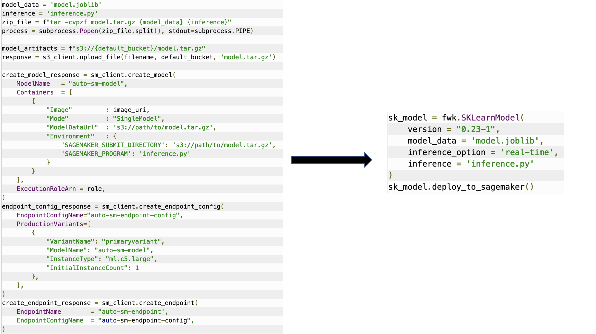

# sagemaker-migration-toolkit

> :warning: This is not inteded for production workloads. Please use this for testing and/or experimental workloads.

This library provides a set of helper functions to deploy your pretrained models to SageMaker Real Time Endpoints. This library currently supports SKLearn, PyTorch, and Tensorflow models. 

Deploying your pre-trained models on SageMaker allows you to benefit from scalable cloud based model inference. Currently you can deploy models on Amazon SageMaker via the AWS SDKs or SageMaker Python SDK. This process can be a little tedious for new users of AWS or SageMaker. SageMaker Migration Toolkit serves as a wrapper around these SDKs and helps Data Scientists focus on purely model deployment.

## AWS SDKs vs sagemaker-migration-toolkit


## Setup

### Installing the library
1. Clone GitHub repo
2. `python setup.py bdist_wheel`
3. `pip install dist/sagemaker_migration_toolkit-0.0.1-py3-none-any.whl`

### Setup AWS credentials
The functions in this library will create resources on Amazon SageMaker and require an IAM role that has policies which allow creating SageMaker Models, Endpoint Configurations, and Endpoints. It is best practice to create a role with the least priviledges needed. 

For a quick start, you can use the Amazon managed SageMaker Exection Role - 
`role = arn:aws:iam::<ACCOUNT>:role/service-role/AmazonSageMaker-ExecutionRole-20210412T095523`

This library will look for the role in a file called `config.ini` stored in `$HOME`. You can create this file by running the following command - 

`sagemaker_migration-configure --module-name sagemaker_migration.configure`

This will prompt you to enter the role required for SageMaker. The file `config.ini` will look like - 

```
[AWS]
role = arn:aws:iam::<ACCOUNT>:role/service-role/AmazonSageMaker-ExecutionRole-20210412T095523
```

### Saving your pretrained models

The models you have trained need to be saved in a specific format required by SageMaker. The format is dependent on the framework you are using and contains two core components -
* The trained model file
* The code required to get predictions from the model

Each framework has a different structure it needs to be saved in, reference the guide below for how to provide your model artifacts and inference script for Sklearn, Tensorflow, and PyTorch. **Please make sure to adhere to the saved model formats displayed below to ensure successful deployment.**

#### SKLearn
```
model.joblib

inference.py
```
#### PyTorch
```
model.pth

inference.py
```

#### Tensorflow
```
model_artifact_version/

    variables/
        variables.data
        variables.index

    keras_metadata.pb
    
    saved_model.pb
    
inference.py
```

### sagemaker-migration-toolkit usage

#### SKLearn Example
```
# Real Time
sk_model = fwk.SKLearnModel(
    version = "0.23-1", 
    model_data = 'model.joblib',
    inference_option = 'real-time',
    inference = 'inference.py',
    instance_type = 'ml.m5.xlarge'
)
sk_model.deploy_to_sagemaker()

# Serverless
sk_model = fwk.SKLearnModel(
    version = "0.23-1", 
    model_data = 'model.joblib',
    inference_option = 'serverless',
    inference = 'inference.py',
    concurrency = 5
)

sk_model.deploy_to_sagemaker()
```

#### Tensorflow Example
```
# Real Time
tf_model = fwk.TensorFlowModel(
    version = "2.8.0", 
    model_data = '0000001', # 000001 is the model data directory
    inference_option = 'real-time',
    inference = 'inference.py',
    instance_type = 'ml.m5.xlarge'
)


# Serverless
tf_model = fwk.TensorFlowModel(
    version = "2.8.0", 
    model_data = '0000001',
    inference_option = 'serverless',
    inference = 'inference.py',
    concurrency = 5
)

tf_model.deploy_to_sagemaker()
```

#### PyTorch Example
```
# Real-Time
pt_model = fwk.PyTorchModel(
    version = "1.11.0", 
    model_data = 'model.pth',
    inference_option = 'real-time',
    inference = 'inference.py',
    instance_type = 'ml.m5.xlarge'
)

pt_model.deploy_to_sagemaker()


# Serverless

pt_model = fwk.PyTorchModel(
    version = "1.11.0", 
    model_data = 'model.pth',
    inference_option = 'serverless',
    inference = 'inference.py',
    concurrency = 5
)

pt_model.deploy_to_sagemaker()
```
